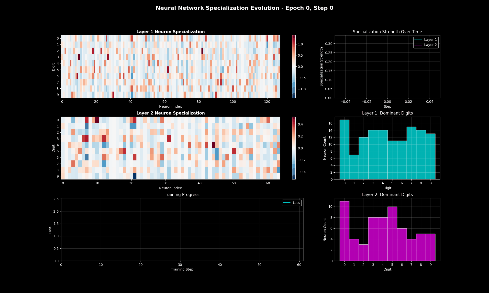

# MNIST Neural Network Visualization

Interactive visualization of neural network training and inference on MNIST dataset.



*This animation from weight_evolution_animation.py shows how neurons progressively specialize to recognize specific digits during training. Each pixel represents a neuron's activation relative to its mean activation across all digits (differential activation). Red indicates neurons that activate above their mean for specific digits, blue shows below-mean activation. Watch as the network learns to dedicate different neurons to different digit patterns.*

## Features

- **Training Visualization**: Watch weights evolve and loss decrease during training
- **Activation Patterns**: See how neurons activate for different inputs
- **Interactive Explorer**: Slider-based exploration of network behavior on test samples
- **Architecture Diagram**: Visual representation of the network structure
- **Statistical Analysis**: Correlation matrices and sparsity analysis

## Installation

```bash
pip install -r requirements.txt
```

## Usage

### Advanced Weight Evolution and Specialization Analysis
```bash
python weight_evolution_animation.py [--epochs 3] [--record-every 5] [--fps 10]
```

This comprehensive visualization tool generates multiple outputs showing how neural networks learn:

#### Generated Files:
- `specialization_evolution.gif` - Animated visualization of neuron specialization during training (shown above)
- `weight_evolution.gif` - Complete weight evolution animation with training progress
- `weight_evolution_interactive.png` - Screenshot of interactive visualization interface
- `all_digits_inference.png` - Comprehensive inference analysis for all digits 0-9
- `digit_activation_analysis.png` - Differential activation patterns for each digit
- `network_specialization.png` - Matrix showing which neurons specialize for which digits

#### Key Features:
- **Weight Evolution Tracking**: Records and visualizes how all network weights change during training
- **Neuron Specialization Analysis**: Shows how neurons progressively specialize for specific digit patterns using differential activations (relative to mean)
- **Dual Mode Visualization**:
  - Training mode: Watch weights evolve step-by-step during training
  - Inference mode: Analyze how the trained network processes each digit
- **Interactive Controls**: Play/pause animation, frame-by-frame navigation with slider, mode switching
- **Weight Distribution Analysis**: Real-time histogram showing weight value distribution with mean/median statistics
- **Comprehensive Inference Analysis**:
  - Per-digit weight visualization
  - Prediction confidence scores
  - Activation gradients and input importance
- **Specialization Matrices**: Visualize which layer neurons respond most strongly to each digit class
- **Multi-view Displays**: Simultaneous visualization of weights as pixels, layer-specific patterns, loss curves, and accuracy metrics

#### Command Line Options:
- `--epochs`: Number of training epochs (default: 3)
- `--record-every`: Record weights every N training steps (default: 5)
- `--fps`: Frames per second for GIF animations (default: 10)
- `--max-frames`: Maximum frames in animation (default: 150)

### Basic Training Visualization
```bash
python train_visualized.py
```

This generates:
- `weight_evolution.png` - Weight distribution changes during training
- `activation_patterns.png` - Neuron activation heatmaps
- `inference_visualization.png` - Single inference breakdown
- `training_animation.gif` - Animated training progress

### Interactive Visualization
```bash
python interactive_visualization.py
```

This creates:
- Interactive neuron explorer with sample slider
- Network architecture diagram
- Activation correlation analysis

## Network Architecture

- Input: 784 neurons (28x28 flattened MNIST images)
- Hidden Layer 1: 128 neurons with ReLU
- Hidden Layer 2: 64 neurons with ReLU
- Output: 10 neurons (digit classes 0-9)

## Key Insights

The visualizations reveal:
- How different neurons specialize for different digit patterns
- Weight distribution evolution from random to structured
- Activation sparsity patterns
- Layer-wise information flow